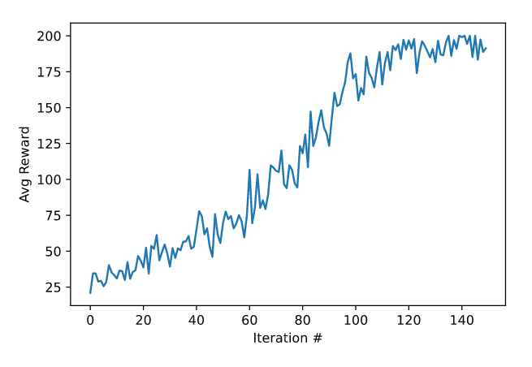
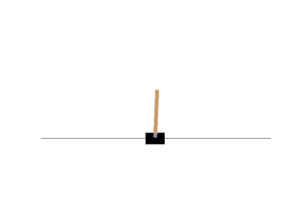

# CartPole-v0
## Description
CartPole-v0 is an OpenAI gym environment in which a pole is attached by an un-actuated joint to a cart, which moves along a frictionless track. The system is controlled by applying a force of +1 or -1 to the cart. The pendulum starts upright, and the goal is to prevent it from falling over. A reward of +1 is provided for every timestep that the pole remains upright. The episode ends when the pole is more than 15 degrees from vertical, or the cart moves more than 2.4 units from the center.
CartPole-v0 defines "solving" as getting average reward of 195.0 (max 200.0) over 100 consecutive trials.    
    
I have used a simple algorithm called REINFORCE to get an average reward of **196.07** in 100 consecutive episodes on this task. REINFORCE belongs to a special class of Reinforcement Learning algorithms called Policy Gradient algorithms.   

## Prerequisites & Usage
Pyhton 3 is required for running [agent.py](agent.py). The libraries and their versions required can be found in the corresponding [requirements.txt](requirements.txt) file. They can be installed with the following command in the terminal:   
`pip3 install -r requirements.txt`   
   
After the requirements are satisifed, run the the Python file in terminal with:    
`python3 agent.py` 

## Observation
When the file is running, *Iteration Number* and *Mean Rewards* of training phase is displayed. After 150 iterations of training, the training reward peaks 200.0. Running the policy learned by the neural network on 100 consecutive episodes yields the final mean reward to of 196.07 ± error. The graph of training error v/s iteration number is as follows:   

## Result
The neural network successfully learns the policy to balance the pole. Here is the [sample GIF](animation.gif) that shows the pole being balanced for 200 steps:   

